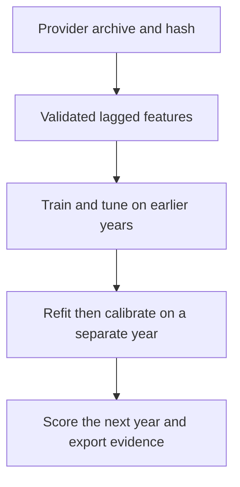

# Equity Direction Benchmark

A runnable financial machine-learning research project on **real US equity-market data**. It asks whether lagged market, size and value factors improve the probability forecast of a positive next-observation market excess return.

The focus is the research workflow: validated data ingestion, chronological experiments, probability calibration, honest baselines and auditable results. The project was created with **OpenAI Codex assistance for Ehsan Cheraghi** in September 2026. It is a portfolio research implementation, separate from prior freelance employment and unaffiliated with Alipes or the data provider.

## Result first

The experiment ran on **1,508 observations across six annual forward tests, 2020-2025**. The validation-selected workflow did **not establish a reliable improvement** over the simple historical-prior baseline.

| Forecast | Brier score ↓ | Log loss ↓ | Direction accuracy |
| --- | ---: | ---: | ---: |
| Historical prior | 0.248563 | 0.690271 | 53.91% |
| Validation-selected workflow | 0.248145 | 0.689421 | 53.51% |

The paired 95% block-bootstrap interval for the Brier difference is **[-0.001607, +0.000754]**, which includes zero. These are executed results, not mock scores. All candidate families, including worse-performing ones, remain in the [full report](reports/RESULTS.md).


**Scope:** historical research on revised daily factor data. This is neither high-frequency data nor a live trading system. Lagged features prevent computational look-ahead in the downloaded vintage, but the provider's publication delays and historical revisions prevent a claim of point-in-time tradability.

## What is implemented

| Research task | Implementation |
| --- | --- |
| Data preparation | Official ZIP download, schema/unit validation, missing-value rejection and SHA-256 provenance |
| Time-series features | 31 lagged return, rolling mean/volatility and risk-free-rate features |
| Candidate models | Standardized logistic regression and histogram gradient boosting with small fixed grids |
| Benchmarking | Historical-prior and 50% baselines; annual train/tune/calibrate/test windows with gaps |
| Calibration | Separate recent-year sigmoid fit; both raw and transformed probabilities retained |
| Evaluation | Brier, log loss, ROC AUC, balanced accuracy, reliability bins and paired block uncertainty |
| Monitoring prototype | Trailing probability loss and reference-binned feature PSI, evaluated retrospectively |
| Reproducibility | Pinned core dependencies, complete prediction CSV, stage audit, source hash and local model artifact |
| Verification | Offline integrity and end-to-end tests, committed-result audit, GitHub Actions workflow |

## Run it

Python **3.11 or later**; Python 3.12 was used for the published run. A fresh virtual environment is recommended. From the repository root:

```bash
python -m pip install -e .
python -m equity_benchmark.cli download
python -m equity_benchmark.cli run
python -m unittest discover -s tests -v
```

The commands also work in PowerShell with a Python environment activated. No API key, paid service or GPU is required. The initial download requires internet access; the cached experiment and tests can run offline. Do not install packages into a system-managed Python environment.

`run` writes `reports/metrics.json`, `predictions.csv`, `RESULTS.md` and three figures. A local `artifacts/final_fold.joblib` stores the final year's models and calibration objects. Raw data and model binaries are excluded from git. To keep the committed results unchanged during a new run:

```bash
python -m equity_benchmark.cli run --output artifacts/my_run/reports --artifacts artifacts/my_run/models
```

For an exact comparison, retain the original ZIP and require its SHA-256:

```bash
python -m equity_benchmark.cli run --expected-sha256 2f29e22546069914890a712680a6f81f3680ebc3543b52864484d209ca13a7db
```

A future provider download may have a different hash even for the same historical dates. The guard deliberately fails in that case; it does not silently substitute another data vintage. See [data provenance](docs/DATA.md).

After running the experiment, replay one historical forecast with your **locally generated** artifact:

```bash
python -m equity_benchmark.cli replay --date 2025-06-30
```

The output records the target date, last feature observation, last fitting label and probability. It refuses dates before the final model's test window and mismatched source vintages. This is a replay, not a live forecast. `joblib` artifacts use pickle; load only artifacts you generated and trust.

## Evaluation design

For test year Y, training expands from 1990 through Y-3; tuning uses Y-2; calibration uses Y-1; test uses Y. Five observations are excluded at the end of each pre-test stage. Feature values at t use t-1 or earlier. Candidate selection uses tuning Brier score; base estimators are then refitted on train plus tune, and calibration uses a disjoint year. Test scores never determine the chosen family.

The fixed rule calibrates a selected ML family. It does not choose calibration based on test performance. The historical-prior forecast uses all eligible known labels. A simpler model is allowed to win. See [the full protocol](docs/PROTOCOL.md) for exact grids, units and assumptions.



## Navigate the evidence

- [Executed results and figures](reports/RESULTS.md)
- [Every out-of-sample probability and binary outcome](reports/predictions.csv)
- [Candidate choices, exact scores and stage boundaries](reports/metrics.json)
- [Fixed experiment protocol](docs/PROTOCOL.md)
- [Data definitions and availability limitations](docs/DATA.md)
- [Interview walkthrough and next experiments](docs/INTERVIEW_GUIDE.md)

## Limitations that matter

The current archive is not point-in-time data. The target is a research portfolio's excess-return direction, not an executable asset. The small calibration year can add variance, and an expanding training window can lag structural change. Pooled AUC can reflect differences between annual forecasts, so annual metrics are also supplied. The bootstrap conditions on fitted models and cannot prove an edge. No execution, costs, slippage, risk sizing, live service or production deployment has been tested.

The implementation covers data preparation, model calibration, benchmarking and time-series workflow design relevant to quantitative ML research. It does not claim high-frequency infrastructure, out-of-core scale or novel neural architectures.

## Sources and license

Data: [Kenneth R. French Data Library](https://mba.tuck.dartmouth.edu/pages/faculty/ken.french/data_library.html) and [factor definitions](https://mba.tuck.dartmouth.edu/pages/faculty/ken.french/Data_Library/f-f_factors.html). Probability-calibration background: [scikit-learn documentation](https://scikit-learn.org/stable/modules/calibration.html).

Project code is [MIT licensed](LICENSE). Source financial data retain their providers' rights and are downloaded separately. The reported experiment is reproducible research, not investment advice or evidence of live profitability.
