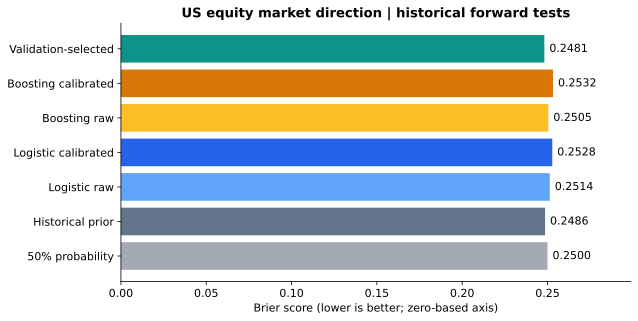
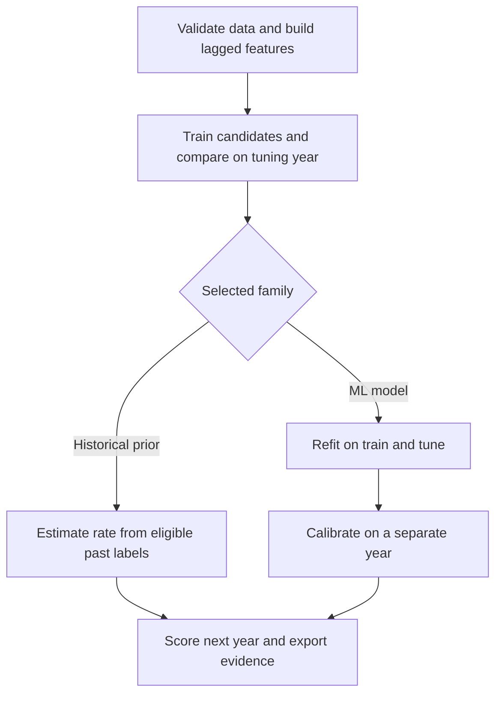

# Equity Direction Benchmark

**Machine learning research on real financial time series — from data preparation to reproducible model evaluation.**

Can past market, size and value signals improve the forecast that the next observed US market excess return will be positive? This Python project tests that question with feature engineering, model comparison, probability calibration and evaluation on later years.

**31 features · 6 annual forward tests · 1,508 test observations · No GPU or API key required**

[Results](reports/RESULTS.md) · [Research skills](#research-skills-demonstrated) · [Run the project](#run-the-project) · [Interview walkthrough](docs/INTERVIEW_GUIDE.md)

**Main finding:** the selected workflow slightly reduced probability error, but the uncertainty interval includes no improvement over the historical baseline. The value of the project is a transparent, reproducible experiment with inspectable decisions and results.



## Results at a glance

The evaluation covers **2020–2025**, testing each year using models fitted on earlier years. Brier score measures the mean squared error of predicted probabilities; lower is better. The historical-prior baseline forecasts the proportion of positive outcomes in earlier eligible data.

| Forecast | Brier score ↓ | Log loss ↓ | Direction accuracy |
| --- | ---: | ---: | ---: |
| Historical prior | 0.248563 | 0.690271 | 53.91% |
| Validation-selected workflow | 0.248145 | 0.689421 | 53.51% |

The selected workflow can choose the historical prior, logistic regression or gradient boosting using the tuning year. It is not the best model chosen after inspecting test scores. Its paired 95% block-bootstrap interval for the Brier difference is **[-0.001607, +0.000754]**, so the experiment **does not establish a reliable improvement**. Accuracy alone is misleading because positive outcomes are more common.

See the [full results](reports/RESULTS.md) for every candidate, annual results, calibration plots and uncertainty assumptions. All scores come from the executed code.

## Research skills demonstrated

The repository makes core tasks in a machine learning research role easy to inspect:

| Skill | Evidence in this project | Inspect |
| --- | --- | --- |
| Data preparation | Validate schemas, units, dates and missing values; record the source archive hash | [Data ingestion](src/equity_benchmark/data.py) |
| Feature engineering | Create 31 lagged returns, rolling means, volatility and risk-free-rate features | [Feature code](src/equity_benchmark/features.py) |
| Experiment design | Separate training, tuning, calibration and testing in time, with gaps between stages | [Split logic](src/equity_benchmark/splits.py) · [Protocol](docs/PROTOCOL.md) |
| Model development | Compare standardized logistic regression and histogram gradient boosting with simple baselines; retain raw and calibrated forecasts | [Models](src/equity_benchmark/models.py) · [Experiment](src/equity_benchmark/experiment.py) |
| Critical evaluation | Report Brier score, log loss, ROC AUC, balanced accuracy and uncertainty, including weaker results | [Metrics](src/equity_benchmark/metrics.py) · [Report](reports/RESULTS.md) |
| Reproducible engineering | Pin core dependencies, export predictions and stage audits, test integrity and replay saved models | [Tests](tests) · [CLI](src/equity_benchmark/cli.py) |

**Stack:** Python, pandas, NumPy, scikit-learn, Matplotlib, joblib and unittest. A GitHub Actions [test workflow](.github/workflows/tests.yml) is included.

## How the experiment works

For each test year **Y**, training starts in 1990 and ends in **Y−3**, tuning uses **Y−2**, calibration uses **Y−1**, and evaluation uses **Y**. Five observations are removed from the end of each pre-test stage. Features use only earlier observations within the downloaded data vintage.



Selection uses tuning Brier score. A selected ML model always receives sigmoid calibration; test results do not decide whether to apply it. The [protocol](docs/PROTOCOL.md) documents the grids, split boundaries and assumptions.

## Run the project

Python **3.11 or later**; Python 3.12 was used for the published run. A fresh virtual environment is recommended. From the repository root:

```bash
python -m pip install -e .
python -m equity_benchmark.cli download
python -m equity_benchmark.cli run
python -m unittest discover -s tests -v
```

The commands also work in PowerShell with a Python environment activated. The initial download requires internet access; the cached experiment and tests can run offline.

`run` writes exact scores, predictions, an evaluation report and three figures to `reports/`. It also saves the final year's models and calibration objects locally. Raw data and model binaries are excluded from git.

<details>
<summary>Reproduce the data vintage, preserve existing results and replay a forecast</summary>

To keep the committed results unchanged during a new run:

```bash
python -m equity_benchmark.cli run --output artifacts/my_run/reports --artifacts artifacts/my_run/models
```

For an exact comparison, retain the original ZIP and require its SHA-256:

```bash
python -m equity_benchmark.cli run --expected-sha256 2f29e22546069914890a712680a6f81f3680ebc3543b52864484d209ca13a7db
```

A future provider download may have a different hash even for the same historical dates. The guard deliberately fails in that case; it does not silently substitute another data vintage. See [data provenance](docs/DATA.md).

After running the experiment, replay one historical forecast with your **locally generated** artifact:

```bash
python -m equity_benchmark.cli replay --date 2025-06-30
```

The output records the target date, last feature observation, last fitting label and probability. It refuses dates before the final model's test window and mismatched source vintages. This is a replay, not a live forecast. `joblib` artifacts use pickle; load only artifacts you generated and trust.

</details>

## Navigate the evidence

- [Executed results and figures](reports/RESULTS.md)
- [Every out-of-sample probability and binary outcome](reports/predictions.csv)
- [Candidate choices, exact scores and stage boundaries](reports/metrics.json)
- [Fixed experiment protocol](docs/PROTOCOL.md)
- [Data definitions and availability limitations](docs/DATA.md)
- [Interview walkthrough and next experiments](docs/INTERVIEW_GUIDE.md)

## Scope and limitations

- **Historical research:** the provider revises daily factors and does not supply historical publication timestamps. Lagging features prevents computational look-ahead within this vintage, but cannot establish that the data were available at the time.
- **Limited evidence of prediction:** the interval includes zero improvement; calibration can add variance, and changing market conditions can weaken models. Annual metrics are supplied because pooled AUC can reflect differences between yearly forecasts.
- **No trading or deployment claim:** the target is a research portfolio's excess-return direction. Execution, costs, slippage, risk sizing and live production performance have not been tested. Rolling loss and feature-distribution diagnostics are retrospective monitoring prototypes.

See [data limitations](docs/DATA.md) and the [research protocol](docs/PROTOCOL.md) for details. Possible extensions are documented in the [interview guide](docs/INTERVIEW_GUIDE.md).

## Project background, sources and license

Created with **OpenAI Codex assistance for Ehsan Cheraghi** in September 2026. This is a portfolio research implementation, separate from prior freelance employment and unaffiliated with Alipes or the data provider.

Data: [Kenneth R. French Data Library](https://mba.tuck.dartmouth.edu/pages/faculty/ken.french/data_library.html) and [factor definitions](https://mba.tuck.dartmouth.edu/pages/faculty/ken.french/Data_Library/f-f_factors.html). Probability-calibration background: [scikit-learn documentation](https://scikit-learn.org/stable/modules/calibration.html).

Project code is [MIT licensed](LICENSE). Source financial data retain their providers' rights and are downloaded separately. The reported experiment is reproducible research, not investment advice or evidence of live profitability.
