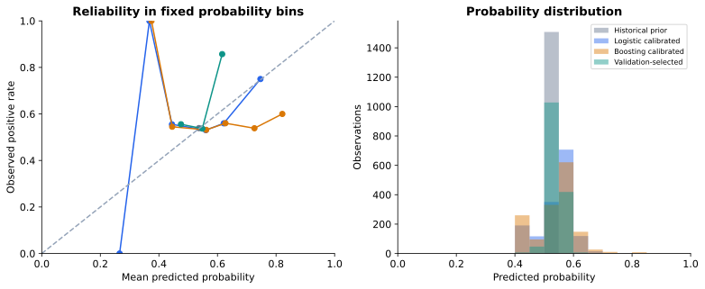
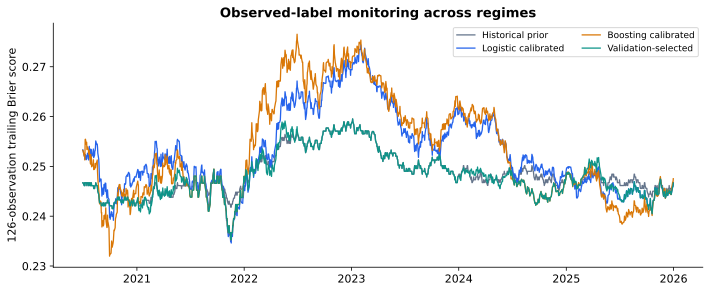

# Executed research results

The paired block interval includes zero. This experiment does not establish a reliable Brier-score improvement over the historical-prior baseline.

Generated from 1,508 real-data target observations across 6 annual forward tests.

## Aggregate probability scores

| Model | Brier ↓ | Log loss ↓ | Accuracy | Balanced accuracy | ROC AUC |
| --- | ---: | ---: | ---: | ---: | ---: |
| 50% probability | 0.250000 | 0.693147 | 53.91% | 50.00% | 0.5000 |
| Historical prior | 0.248563 | 0.690271 | 53.91% | 50.00% | 0.4743 |
| Logistic raw | 0.251357 | 0.695881 | 50.27% | 47.87% | 0.4880 |
| Logistic calibrated | 0.252776 | 0.698805 | 51.53% | 49.23% | 0.4887 |
| Boosting raw | 0.250481 | 0.694167 | 52.65% | 49.85% | 0.4913 |
| Boosting calibrated | 0.253232 | 0.700084 | 51.66% | 49.60% | 0.5028 |
| Validation-selected | 0.248145 | 0.689421 | 53.51% | 49.88% | 0.5126 |

The historical prior predicts the positive fraction in the known training, tuning and calibration labels. A high directional accuracy can reflect this positive-class imbalance; Brier score is the primary selection metric.

## Annual decisions and results

| Test year | Training rows | Tuning choice | Issued output | Selected Brier | Prior Brier |
| --- | ---: | --- | --- | ---: | ---: |
| 2020 | 7051 | historical_prior | historical_prior | 0.244572 | 0.244572 |
| 2021 | 7302 | histgb_leaves3 | histgb_sigmoid | 0.245903 | 0.246323 |
| 2022 | 7554 | historical_prior | historical_prior | 0.257258 | 0.257258 |
| 2023 | 7807 | historical_prior | historical_prior | 0.248419 | 0.248419 |
| 2024 | 8059 | histgb_leaves7 | histgb_sigmoid | 0.247815 | 0.248440 |
| 2025 | 8310 | logistic_C1 | logistic_sigmoid | 0.244930 | 0.246399 |

Hyperparameters and model family are chosen on the tuning year. Sigmoid calibration is always applied to a selected ML family; its inclusion is fixed in advance, not selected on test results. Both raw and calibrated scores are shown for audit. Prior years' test observations may become later years' training data once in the past.

## Uncertainty

Selected minus prior mean Brier difference: **-0.000418**. Paired 95% block-bootstrap interval: **[-0.001607, +0.000754]**.

2000 paired circular resamples, blocks of 20 observations, resampling within each test year. The interval is conditional on fitted models, the fixed protocol and the source vintage; it does not include model refitting uncertainty, historical revisions or publication latency.

## Calibration and monitoring

Bin counts and exact values are in metrics.json; sparse reliability bins can be noisy. Calibration can worsen results under regime changes.

Rolling scores use already observed outcomes and are descriptive. Feature PSI values are computed using reference-only quantile bins and stored per fold; they are not causal explanations or an automatic retraining policy.

## Provenance and scope

Source archive SHA-256: `2f29e22546069914890a712680a6f81f3680ebc3543b52864484d209ca13a7db`.

The provider revises historical factors and does not provide point-in-time daily publication timestamps in this archive. The split prevents computational look-ahead within this downloaded vintage, but not vintage/revision or publication-delay bias. Daily factors are research portfolio returns, not an executable instrument. No P&L, fills, transaction costs, live monitoring or production trading performance are claimed.

Files: [metrics.json](metrics.json), [predictions.csv](predictions.csv), [data_manifest.json](data_manifest.json).
